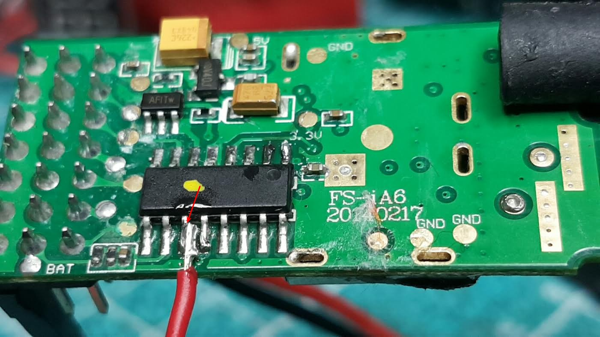

# Semi iBus2USB v1.0

## Only for Flysky fs-ia6 receiver

This Sketch takes FlySky **semi** i-Bus Serial data from the fs-ia6 receiver and turns it into an USB Joystick to use with various simulators (Tested in Aerofly RC7).

This is based on [darven discovery, on RCgroups](https://www.rcgroups.com/forums/showthread.php?2711184-Serial-output-from-FS-IA6-%28Semi-I-BUS%29)

**Target:** Arduino Pro Micro

**Prerequisite:** Have the Joystick library included in your "Arduino/libraries" folder*
  
**Supported receiver**

**Get Semi iBus from fs-ia6 receiver:**

     

**Wiring receiver (~5V):**

**\*** Using the [ArduinoJoystickLibrary from MHeironimus on GitHub](https://github.com/MHeironimus/ArduinoJoystickLibrary)
 
Also inspired by [*iBus2PPM* from *povlhp* on GitHub](https://github.com/povlhp/iBus2PPM) for the iBus data reading loop that I adapted for the Pro Micro board.
  
I am using a FlySky FS-i6 transmitter with [*FlySky-i6-Mod-* custom firmware from *benb0jangles* on GitHub](https://github.com/benb0jangles/FlySky-i6-Mod-) which unlocks all 14 channels when using iBus.

